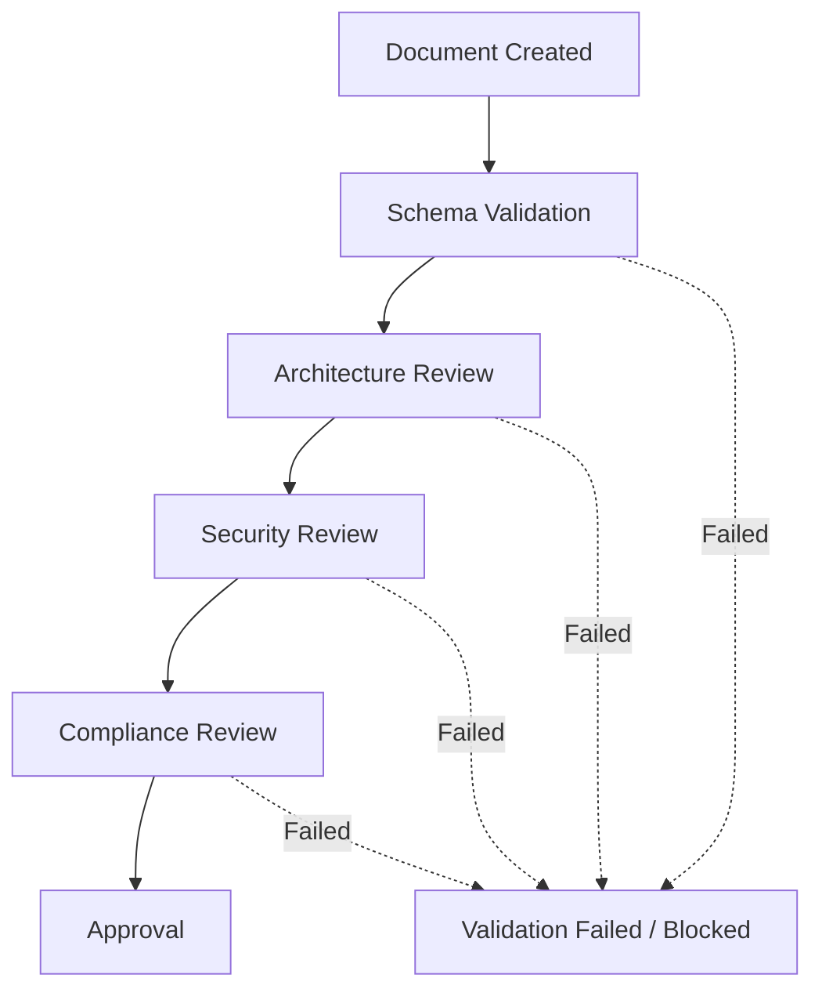

# Governance Validation Pipeline

為確保所有的修改與決策皆符合 Enterprise AI Engineering Governance 規範，任何重要文件的變更或建立，都必須經過本 Validation Pipeline。

## Pipeline 流程

## 關卡說明

1. **Document Created**
   - 文件被建立或修改。狀態設為 `Draft`。
   
2. **Schema Validation**
   - 檢查 Metadata (YAML Frontmatter) 是否齊全。
   - 確認 Document ID, Version, Owner 等欄位格式正確。

3. **Architecture Review**
   - 由 architecture-reviewer 進行檢查。
   - 確認是否違反既有系統架構設計與 ADR。

4. **Security Review**
   - 由 Security Agent 進行檢查。
   - 確認是否包含安全漏洞、不安全的實作或違反 `security-rules.md`。
   - 若有高風險，Security Agent 將直接 Block。

5. **Compliance Review**
   - 確保持續合規，符合組織的 Governance Policy 規定。

6. **Approval**
   - 上述所有關卡皆通過後，狀態才能變更為 `Approved`。
   - **強制性規定**：任何一步失敗，文件不得進入 Approved 狀態，必須退回修正。
