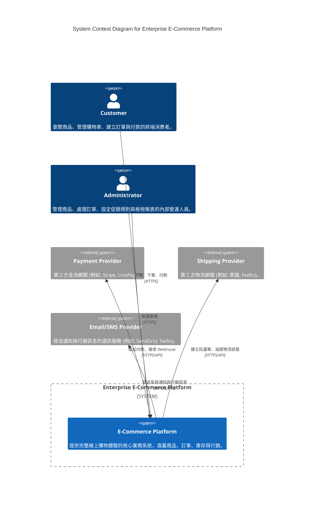

# C4 Level 1 — System Context

## 1. System Context Diagram

## 2. External Actors Analysis

### 1. Customer (消費者)
- **Interaction:** 透過瀏覽器或 Mobile App 進入前台系統。
- **Data Exchange:** 提交註冊資料、搜尋關鍵字、訂單資訊、付款授權碼；接收商品清單、訂單狀態更新。
- **Business Purpose:** 探索商品並完成購買，為平台產生直接營收。

### 2. Administrator (系統管理員)
- **Interaction:** 透過內部網路或 VPN 存取後台管理介面。
- **Data Exchange:** 新增/修改商品 (Catalog)、設定促銷規則 (Marketing)、變更訂單狀態、查詢報表。
- **Business Purpose:** 維護平台日常營運，確保履約順利，並策劃行銷活動。

## 3. External Systems Analysis

### 1. Payment Provider (第三方金流)
- **Interaction:** 系統將使用者導向付款網關，或透過 Server-to-Server API 發起授權，隨後接收非同步 Webhook。
- **Data Exchange:** 傳送訂單金額、交易序號；接收付款授權結果 (Success/Failed/Refunded)。
- **Business Purpose:** 將高風險的信用卡或數位錢包扣款流程外包，符合 PCI-DSS 合規性。

### 2. Shipping Provider (第三方物流)
- **Interaction:** Server-to-Server API 呼叫。
- **Data Exchange:** 傳送收件人地址、包裹材積；接收物流追蹤碼 (Tracking Number) 與配送狀態。
- **Business Purpose:** 解決實體商品最後一哩路的履約問題，減少內部車隊建置成本。

### 3. Email/SMS Provider (通訊服務)
- **Interaction:** Server-to-Server API 呼叫 (單向為主)。
- **Data Exchange:** 傳送接收者信箱/手機、訊息樣板與參數；接收發送狀態 (Delivered/Bounced)。
- **Business Purpose:** 確保關鍵交易通知（如訂單成立、密碼重置）高送達率，並支援行銷推播。
