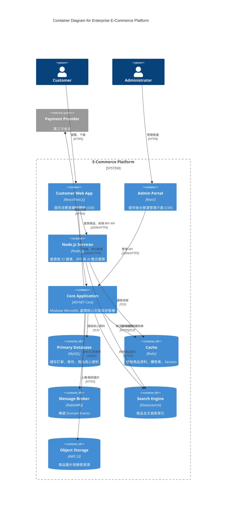

# C4 Level 2 — Container Diagram

## 1. Container Architecture Analysis

根據 ADR-001 確立的 Hybrid Architecture，本平台的核心架構為一個 ASP.NET Core 單體，搭配數個 Node.js 獨立服務與關聯式資料庫。

### Frontend (前端應用)
- **Customer Web Application (React / Next.js):**
  - 提供給消費者的前台介面。運用 Next.js 的 SSR/SSG 特性優化 SEO 與首屏載入速度，直接與 Node.js BFF (Backend for Frontend) 或 Search Service 互動。
- **Admin Portal (React / Next.js):**
  - 提供給管理員的後台介面。由於重視互動性與複雜表單，採用 React CSR (Client-Side Rendering) 即可，直接對接 ASP.NET Core Monolith API。

### Backend (後端核心)
- **ASP.NET Core Application (Modular Monolith):**
  - 承載所有具備強事務 (ACID) 與高一致性要求的核心業務，包含 Order, Inventory, Catalog (Command), Identity。

### Services (獨立服務)
- **Node.js Services:**
  - 承載需要極高併發、非同步 I/O 或整合現代 AI 套件的外圍服務。例如專門負責商品檢索的 Search Service、與 OpenAI 對接的 AI Integration Service。

### Database (關聯式資料庫)
- **MySQL:**
  - 核心持久化儲存層。在 Modular Monolith 中，不同模組 (Context) 應使用邏輯上獨立的 Schema 或 Table Prefix 以維持邊界。

### Optional Components (選擇性擴充組件)

我們決定 **加入** 以下組件，因為單靠 MySQL 與 Web Server 無法滿足企業級電商的需求：

1. **Cache (Redis):**
   - **需要原因：** 電商具備「讀多寫少」特性（商品瀏覽），且「購物車」寫入極為頻繁但允許揮發。Redis 提供極低延遲的暫存與 Session 管理，能大幅降低 MySQL 負擔。
2. **Message Broker (RabbitMQ 或 Kafka):**
   - **需要原因：** 落實 Phase 2 的 Domain Event Design。Order 與 Inventory 之間的非同步解耦，以及 Eventual Consistency 的重試機制，必須依賴可靠的 Message Queue。
3. **Search Engine (Elasticsearch 或 Meilisearch):**
   - **需要原因：** 關聯式資料庫 (MySQL) 無法提供高效的全文字模糊搜尋、多維度過濾（如價格區間、屬性 Facets），需要獨立的搜尋引擎支援 Catalog Discovery。
4. **Object Storage (AWS S3 或 Cloud Storage):**
   - **需要原因：** 平台需要儲存大量非結構化資料，如商品圖片、使用者上傳的評價照片。

## 2. Container Diagram (Mermaid)

