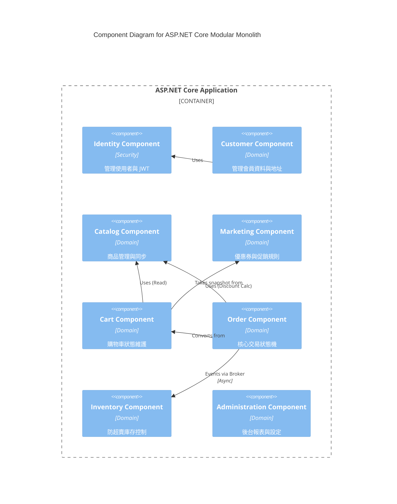

# C4 Level 3 — Component Diagram

## 1. ASP.NET Core Modular Monolith Component Boundary

在 Hybrid Architecture 下，強一致性與核心業務集中於 ASP.NET Core 中。每個 Component 對應一個 Bounded Context，雖然運行在同一 Process，但在程式碼層面維持強隔離。

### 1. Identity Component
- **Responsibility:** 管理用戶註冊、登入 (JWT 發放) 與 RBAC 角色。
- **Owned Domain Model:** User, Role, Permission.
- **Dependency:** None (作為最底層基礎組件)。

### 2. Customer Component
- **Responsibility:** 維護客戶業務特化資料（如收件地址簿、會員等級）。
- **Owned Domain Model:** CustomerProfile, AddressBook.
- **Dependency:** 依賴 Identity (取得 User 識別)。

### 3. Catalog Component (Command Side)
- **Responsibility:** 商品資料的 CRUD、分類樹維護。處理上架邏輯並將資料同步至 Search Engine。
- **Owned Domain Model:** Product, Category, Price.
- **Dependency:** None。

### 4. Cart Component
- **Responsibility:** 處理添加至購物車、數量修改、合併購物車。
- **Owned Domain Model:** Cart, CartItem.
- **Dependency:** 依賴 Catalog (驗證商品是否上架), 依賴 Marketing (試算優惠)。*備註：高頻讀寫可透過 Redis 實作儲存。*

### 5. Order Component
- **Responsibility:** 將 Cart 轉換為正式 Order，管理訂單狀態機，發佈 `OrderPlaced` 等事件。
- **Owned Domain Model:** Order, OrderItem, PaymentRecord.
- **Dependency:** 依賴 Customer (收件人), Catalog (快照), Cart (轉換), 依賴 Message Broker 發送事件給 Inventory。

### 6. Inventory Component
- **Responsibility:** 防止超賣，精準處理庫存預留與扣減。
- **Owned Domain Model:** Stock, Reservation.
- **Dependency:** 監聽 Message Broker 上的 Order 事件。無同步依賴。

### 7. Marketing Component
- **Responsibility:** 管理促銷活動、優惠券發放與折扣規則試算。
- **Owned Domain Model:** Coupon, PromotionRule.
- **Dependency:** 依賴 Catalog (指定商品優惠), Identity (指定用戶)。

### 8. Administration Component
- **Responsibility:** 後台跨領域報表、系統參數全域設定。
- **Owned Domain Model:** SystemConfig, Report.
- **Dependency:** 唯讀存取 Order, Catalog 等其他 Component 的資料。

## 2. Node.js Services Component Boundary

外圍與高併發服務透過 Node.js 獨立部署，以提升效能與系統隔離性。

### 1. Search Service
- **Responsibility:** 承接前台海量的商品搜尋、過濾 (Facet Filtering) 與商品列表請求。
- **Owned Domain Model:** SearchQuery, FilterResult (Read-only DTOs).
- **Dependency:** 專門讀取 Elasticsearch，並將流量與 ASP.NET Core Monolith 徹底隔離。

### 2. Notification Service
- **Responsibility:** 統一處理系統內的非同步對外通訊（Email, SMS）。
- **Owned Domain Model:** NotificationTemplate, DispatchLog.
- **Dependency:** 監聽 Message Broker，對接外部 Email/SMS Provider。

### 3. AI Integration Service
- **Responsibility:** 提供商品智能推薦、客服 Chatbot 等進階擴充功能。
- **Owned Domain Model:** RecommendationContext, ChatSession.
- **Dependency:** 呼叫外部 AI 供應商 API (如 OpenAI)，並透過 API 向 Catalog/Order Component 讀取訓練或上下文資料。

## 3. Component Diagram (Mermaid)

